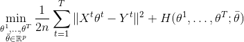
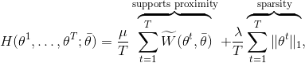
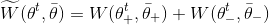

.. project-template documentation master file, created by
   sphinx-quickstart on Mon Jan 18 14:44:12 2016.
   You can adapt this file completely to your liking, but it should at least
   contain the root `toctree` directive.

Welcome to MTW documentation
============================

Wasserestein regularization for sparse Multi-task regression.

Given high dimensional regression datasets :math:`(X^t, y^t) t = 1..T` , MTW solves
the optimization problem:

|eq1|

where:

|eq2|

with

|eq3|

 where W is the Unbalanced KL Wasserstein distance.

Install the development version
===============================

From a console or terminal clone the repository and install MTW:

::

    git clone https://github.com/hichamjanati/mtw.git
    cd mtw/
    conda env create --file environment.yml
    source activate mtw-env
    pip install --no-deps -e .

Demos & Examples
================

Given a ground metric `M` and the entropy parameter that define the Wasserstein
metric, an MTW object can be created and fitted on multi-task regression data
`(X, y)`. Where the shapes of `X` and `Y` are (n_tasks, n_samples, n_features)
and (n_tasks, n_samples)

.. code:: python

>>> from mtw import MTW
>>> import numpy as np
>>> n_tasks, n_samples, n_features = 2, 10, 50
>>> # Compute M as Euclidean distances matrix if not given
>>> grid = np.arange(n_features)
>>> M = (grid[:, None] - grid[None, :]) ** 2
>>> # Some data X and y
>>> X = np.random.randn(n_tasks, n_samples, n_features)
>>> y = np.random.randn(n_tasks, n_samples)
>>> epsilon = 1. / n_features
>>> alpha = 0.1
>>> beta = 0.1
>>> mtw = MTW(alpha=alpha, beta=beta, M=M, epsilon=epsilon)
>>> mtw = mtw.fit(X, y, verbose=False)
>>> coefs = mtw.coefs_

See ./examples for more.

Dependencies
============

All dependencies are in ``./environment.yml``

Cite
====

If you use this code, please cite:

::

    @InProceedings{janati19a,
    author={Hicham Janati and Marco Cuturi and Alexandre Gramfort},
    title={Wasserstein regularization for sparse multi-task regression},
    booktitle = {Proceedings of the Twenty-second International Conference on Artificial Intelligence and Statistics},
    year = 	 {2019},
    volume = 	 {89},
    series = 	 {Proceedings of Machine Learning Research},
    month = 	 {16--19 Apr},
    publisher = 	 {PMLR},
    }

ArXiv link: https://arxiv.org/abs/1805.07833

.. toctree::
   :maxdepth: 2
   :hidden:
   :caption: Documentation

   api

.. toctree::
   :maxdepth: 2
   :hidden:
   :caption: Tutorial - Examples

   auto_examples/index

`API Documentation <api.html>`_
-------------------------------

An example of API documentation.

`Examples <auto_examples/index.html>`_
--------------------------------------

A set of examples. It complements the `User Guide <user_guide.html>`_.
